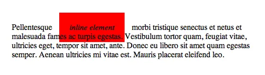
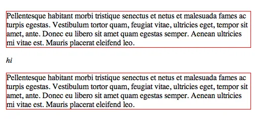
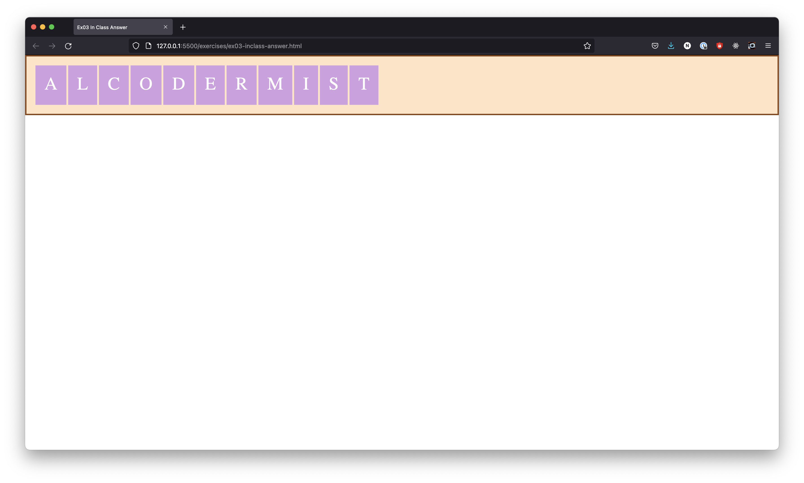

# CSS Layout

Layout คือ การจัดวาง Elements ต่าง ๆ ให้แสดงผลตามที่เราต้องการ

มี 2 อย่างที่สําคัญในการจัด Layout ของ Elements บน Web App

1. Display property
2. Box model

## Display Property

CSS Display Properties เรากำหนดได้ด้วย `display: <inline | block | inline-block>`

CSS Display Properties ตัวหลัก ๆ ที่เราต้องรู้เบื้องต้น มีดังนี้

- inline — Element จะอยู่ในบรรทัดเดียวไม่สามารถกําหนดWidth / Height ของตัว Element ได้



- block — Element จะถูกบล็อกอยู่คนละบรรทัดและสามารถกําหนด Width / Height ได้



- inline-block — ลูกผสมคุณสมบัติระหว่าง inline และ block เราสามารถกําหนด width / height ได้


Reference รูปภาพจาก [CSS-Tricks](https://css-tricks.com/almanac/properties/d/display/)

HTML Elements ทุกๆตัวบนหน้าเว็บมี property display แฝงไว้อยู่เป็นค่าตั้งต้น เช่น

- HTML Elements ที่มี `display: block;` เป็นค่าตั้งต้น มี <div>, <h1>, <section>, <ul>, <p>, etc
- HTML Elements ที่มี `display: inline;` เป็นค่าตั้งต้น มี <span>, <b>, etc

## Box Model

Elements ทุกๆตัวบนหน้าเว็บมีค่า height, width, margin, padding, border แฝงอยู่เป็นค่าตั้งต้น

ยกเว้นพวกที่มี display เป็น inline

สิ่งที่ควรรู้อีกอย่างนึงคือเมื่อเราใส่ padding และ border แล้วจะส่งผลกระทบต่อ width ของกล่อง

ยกตัวอย่างเช่น

ซึ่งเป็นสิ่งที่เราไม่อยากให้มันเป็นแน่นอนมันจะทําให้เราจัดการ layout ยากวิธีการคือให้ select elements ทุกตัวแล้วใส่ box-sizing: border-box; แบบนี้

```html
<style>
  * {
    box-sizing: border-box;
  }
</style>
```

## In Class Exercises - 03 🏅

ให้ทำ Web App ให้เหมือนในภาพนี้



กำหนดให้

- code สีมีดังนี้
  - bisque
  - saddlebrown
  - #d19fe1

Hint

- สิ่งที่ควรรู้อีกอย่างนึงคือเมื่อเราใส่ padding และ border แล้วจะส่งผลกระทบต่อ width ของกล่อง
- Elements ทุกๆตัวบนหน้าเว็บมีค่า height, width, margin, padding, border แฝงอยู่เป็นค่าตั้งต้น

[Answer](https://github.com/napatwongchr/intro-to-html/blob/main/exercises/ex01-inclass-answer.html)
