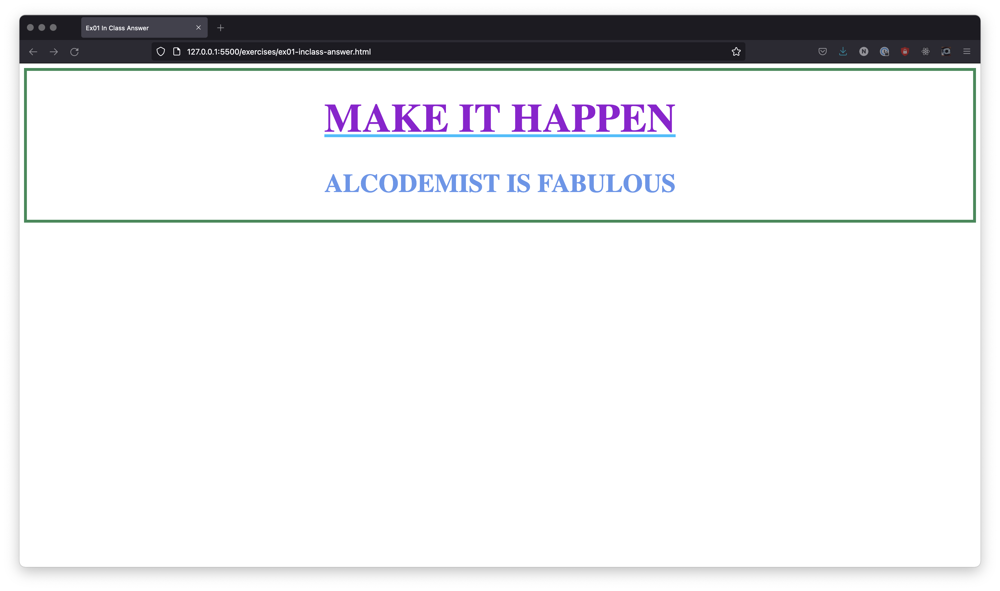

# Selectors and Properties

**Selectors** คือ ตัวที่ไว้ใช้เลือก HTML Elements ต่าง ๆ บนหน้าเว็บเพื่อกําหนดกฏ CSS หรือเราเรียกกฏว่า **Properties**

Selectors แบ่งออกได้เป็นหลายแบบ

- Id selector จะใช้ **#** นำหน้า
- Class selector จะใช้ **.** นำหน้า
- Tag selector จะใช้ **ชื่อ tag** เลยตรง ๆ
- และยังมี selectors แบบอื่น ๆ อีกมากมายที่ควรรู้ เช่น attribute selector, data attribute selector, etc.

ลองมาดูตัวอย่าง code กัน

```html
<h1 class="welcome-text">Welcome To Alcodemist Coding School</h1>
<h2>Alcodemist is fabulous !</h2>
<h2 id="secondary-welcome-text">Coding is fun !</h2>
<style>
  .welcome-text {
    color: crimson;
    font-size: 90px;
    text-decoration-line: underline;
    text-decoration-color: lightsalmon;
    text-transform: uppercase;
  }

  h2 {
    color: lightcoral;
  }

  #secondary-welcome-text {
    color: limegreen;
  }
</style>
```

- `.welcome-text` เป็นการ select html element **ด้วย class** ชื่อว่า welcome-text จากนั้นกำหนด properties ให้
  - `color: crimson;` สีตัวอักษรมีสี crimson
  - `font-size: 90px;` มีขนาดตัวอักษร 90 หน่วยเป็น pixel (px)
  - `text-decoration-line: underline;` ทำให้ข้อความมีเส้นใต้ (underline)
  - `text-decoration-color: lightsalmon;` ทำให้เส้นใต้มีสี lightsalmon
  - `text-transform: uppercase;` ทำให้ข้อความเป็นตัวอักษรตัวใหญ่ทั้งหมด (uppercase)
- `h2` เป็นการ select html element **ด้วย tag** ชื่อว่า h2 จากนั้นกำหนด property `color: lightcoral` ตัวอักษรจะเป็นสี coral
- `#secondary-welcome-text` เป็นการ select html element **ด้วย id** ชื่อว่า secondary-welcome-text จากนั้นกำหนด `color: limegreen;` ทำให้ตัวอักษรมีสีเป็นสี limegreen

## Attribute Selector

Attribute Selector คือ selector ที่ select attribute จาก html tag ได้

ตัวอย่าง code

```html
<style>
  input[type="text"] {
    height: 30px;
    background-color: khaki;
  }
</style>

<div class="username-field-container">
  <label for="username-field"">Username</label>
  <input id="username-field" type="text" />
</div>
```

## Pseudo-Class

Pseudo-class คือ CSS ที่กำหนดขึ้นมาเพื่อเปลี่ยนลักษณะของ html element ตาม CSS properties ที่เรากำหนดให้ ที่เกิดขึ้นจาก dom events

เช่น `:hover` คือ pseudo-class ที่กำหนดขึ้นมาเพื่อเปลี่ยนลักษณะของ html element ตาม CSS properties ที่เรากำหนดให้ เมื่อ user นำเมาส์ไป hover บน element นั้นๆ

ลองดูตัวอย่าง code

```html
<h1 class="welcome-text">Welcome To Alcodemist Coding School</h1>

<style>
  .welcome-text {
    color: crimson;
  }

  .welcome-text:hover {
    color: cornflowerblue;
    font-size: 80px;
    cursor: pointer;
  }
</style>
```

- `.welcome-text:hover` เป็นการ select html element ด้วย class ชื่อ welcome-text จากนั้นใส่ pseudo-class :hover เพื่อให้ element มีการเปลี่ยนแปลงตาม css properties ที่กำหนดจากการนำเมาส์มา hover บน element

## In Class Exercises - 01 🏅

ให้ทำ Web App ให้เหมือนในภาพนี้



**Note**

- ลอง select html elements ด้วย id class tags attributes และ data attributes ตามที่เรียนมา

[Answer](https://github.com/napatwongchr/intro-to-html/blob/main/exercises/ex01-inclass-answer.html)
